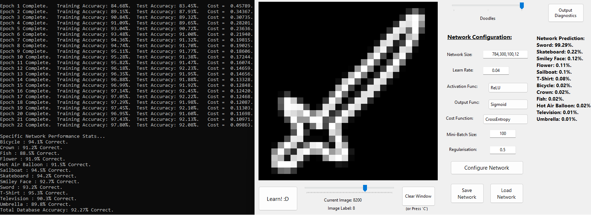
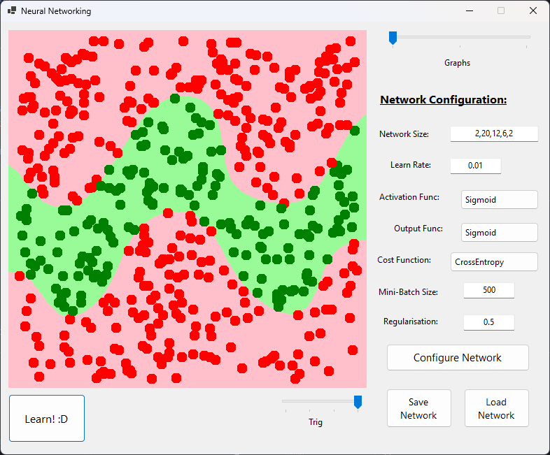
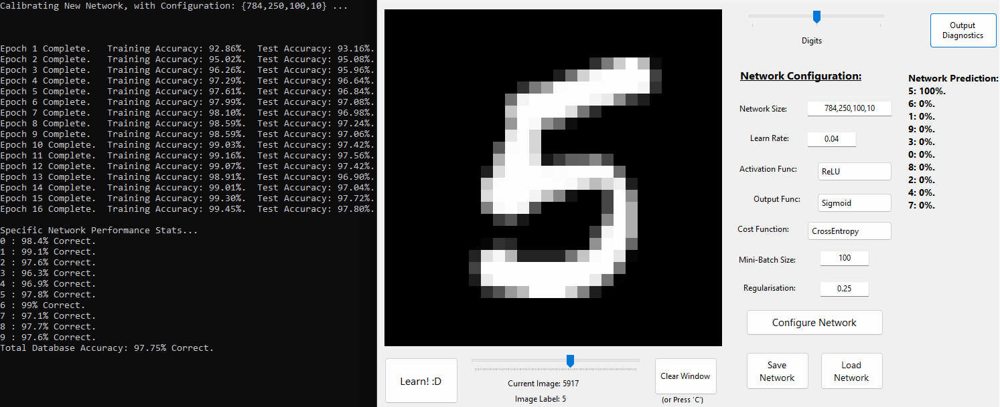

# Digit & Doodle Recognising Neural Network


-%234CAF50.svg?style=for-the-badge)


---

A simple Neural Networking program used to identify user-drawn digits, or doodles of various categories. Trains on 50,000 images from the MNIST Digit database, along with 60,000 user submissions to Google 'Quick Draw', using a heavily optimised and robust gradient descent algorithm. To allow the AI to also recognise the user's own drawings in real-time (which may differ wildly from those in the training data), the training data is heavily augmented with random transformations (scaling, translation, added noise).

In only a couple minutes of training, the program is able to achieve ~98% on the MNIST Digit database, and ~92% on the Google 'Quick Draw' database (12 categories), whilst remaining versatile to user-drawn images.

I plan to revisit this project soon to construct a 'convolution' approach, for more nuanced image recognition & classification. I also intend to implement this Network into a future version of my [**Chess AI**](https://github.com/AlfieKunz/Chess-Game-AI), to make a sophisticated hand-crafted NNUE Evaluation Function.

This work is self-motivated and self-funded, and is written primarily in VB.NET as a Visual Studio WinForms application.

<p align="center">
  
</p>

---

## Features and Highlights

✅ Custom built Neural Network engine (entirely from scratch) in a highly-OOP framework.  
✅ Activation / Output function types: Sigmoid, Perceptron, Tanh, ReLU, SiLU, Softmax.  
✅ Cost functions: Mean Squared Error, Cross-Entropy.  
✅ Hand-derived back propagation theory for gradient descent.  
✅ Mini-batch stochastic-designed gradient descent (with variable batch size).  
✅ Momentum-based acceleration along gradients (with velocity-smoothed weight updates).  
✅ L2 regularisation (weight decay), for contesting overfitting.  
✅ Gaussian weight initialisation via Box-Muller transform, scaled by fan-in (Xavier-style).  
✅ Fisher-Yates reshuffling for the training database.  
✅ Effective multithreading learning process (across mini-batches), with thread-indexed local storage arrays for careful consideration of race conditions.  
✅ Custom binary formatting and importer for the digit & doodle database.  
✅ Strong augmentation of databases for resiliance against user drawings: random rescaling (bilinear interpolation), translations, and noise injection.  
✅ 2D heatmap for the 'Graphs' set, with live updating as the Neural Network evolves.  
✅ Real-time drawing canvas (with the user's mouse): distance-based radial brush with cubic falloff for smooth, antialiased strokes, and erasing tools.  
✅ Real-time Neural Network predictions of the user-drawn image.  
✅ Ability to scrub through all images in the test set, with real-time network predictions.  
✅ Robust user interactions for creating a network: can form dimensions from a config string, and validates network against dataset dimension.  
✅ Highly modular design for adding new databases: 'DataPoint' structure for holding dataset data, 'NetworkSettings' structure for holding Neural Network configuration settings.  
✅ Can produce per-object diagnostic for each database, for debugging and analysis.  
✅ Ability to save and load pre-trained networks, for use in future sessions: serialisation of network architecture & parameters, and deserialisation with automatic network dimension adaptation.  
✅ Colourful, information-dense console log, containing network statistics, learning progress, and debug information.  

---

## Project Showcase

> **Project Demo:** You can see this project live directly through the [**project build**](https://drive.google.com/drive/folders/1Q8x6LexTXxOnXtQItj0eWAFmKeyWTeQQ) (Intel 32/64-bit). Simply click the 'Download All' button in the link attached, unzip and run the "NeuralNetworking.exe" application.

> **Program Controls:**
>1) Once the program has loaded, navigate to the desired training environment using the slider in the top-right corner.
>2) To train a new model, adjust the network configuration settings, click "Configure Network" (resets all weights & biases), and then "Learn! :D".
>3) To load a previously trained model, navigate to your desired mode {Digits, Doodles}, click "Load Network", and select a valid network: typically {DIGIT V6, DOODLE V2}. You can then interact with the black interface screen with the mouse (left click for drawing, right click for erasing), to see the network in action.
>4) To test a model ('Digit' or 'Doodle' modes), drag on the black window to draw and see the network's real-time predictions! (Left click for drawing, right clicks for erasing.) You can also scrub through the test data via the bottom slider, or click "Output Diagnostics" to see where your model strengths & weaknesses are.

Alternatively, one can download the source code, as instructed below, for full control.

<table align="center" width="100%">
  <tr>
    <td align="center" valign="middle" width="35%">
        <p align="center"><b>Simple Data Classification Example</b></p>
        
    </td>
    <td align="center" valign="middle" width="65%">
      <p align="center"><b>97.80% Test Accuracy on the MNIST Dataset</b></p>
      
    </td>
  </tr>
</table>

---

## Technical Details

This engine is built entirely from scratch in VB.NET (no external libraries), as an exercise in self-learning Machine Learning techniques from scratch. Imagining the classification problem of determining if some animal is either a friendly cat or a deadly lion, based on two traits (eg: the size of its mane, and its weight), we want to draw a 'decision boundary' partitioning some sample data into each animal type (see the graph example above).

This is a rather easy problem for a computer to solve: we construct a *graph network* of *neurones*. A neurone is a weighted sum of its inputs (all the neurone outputs from the previous layer of the network), plus a bias, passed through an activation function to its outputs (all the neurone inputs in the next layer). By performing gradient descent on each neurone's weights and biases, with respect to the cost function (ie: the difference in the network's prediction of some data point, vs the ground truth), the network can 'learn' from the data, effectively classifying data outside its training set, and constructing the decision boundary.

However, classifying handwritten digits and doodles requires interpreting hundreds of pixel inputs simultaneously (784 network inputs, vs the 2 of before), and as such simple gradient descent falls short. Hence, training is driven by hand-derived backpropagation: after passing data through the network to calculate the related cost, we move backwards through the network, using the chain rule to calculate the partial cost gradient with respect to each neurone. This tells us the exact gradient magnitude to update each weight & bias by. This algorithm is highly optimised via the features listed in the previous section.

As the MNIST and Quick Draw databases are stored in very controlled environments, a naive implementation can perform very well on the training database, but can fall short for user-drawn images, which are prone to irregularities. To mitigate this, each training image has random transformation & noise injection applied, which massively increases network resiliance.

---

## Installation, and Folder Structure

### Required Software: Visual Studio (.NET 8.0).

To install, simply clone this repository using the following terminal prompts.
```bash
git clone https://github.com/AlfieKunz/Neural-Networking
cd Neural-Networking
```
Then, simply open the "NeuralNetworking.sln" file in Visual Studio.

Feel free to also fork this repository, open an issue, or submit pull requests. All contributions welcome! :)  
To better navigate this project, please see below for the related folder structure.

```
Neural-Networking
├─ Build         
│  ├─ Databases  
│  │  ├─ Digit Database             // Raw MNIST Digit Database, separated into B&W pixel-by-pixel binary files for each digit
│  │  ├─ Doodle Database            // Raw Google 'Quick Draw' database (same format), using 10 sample images types
│  │  └─ Graph Database             // Four 2D databases, categorised into two types: 500 random sample points per file, using formula to decide if a point 'passes'
│  ├─ NeuralNetworking.exe          // Main application
│  └─ Saved Networks                // Folder containing all (text serialised) Neural Network models: core parameters, full list of weights & biases ('DIGIT V6' and 'DOODLE V2' are most accurate)
├─ NeuralNetworking                 //
│  ├─ LayerTypes.vb                 // Classes for various activation and output functions, their functions derivatives: Sigmoid, Perceptron, Tanh, ReLU, SiLU, Softmax
│  ├─ Network.vb                    // The object for a Neural Network: configuration, passing of data through the network, cost function analysis, performance computation, parallelised gradient descent for learning
│  ├─ NetworkLayer.vb               // Code for a single layer of the NN class above: computation of data through nodes, gradient applying & updating, back propagation derivative handling, race conditions
│  ├─ NeuralNetworking.Designer.vb  // WinForms design for the main program form: forms the main GUI
│  └─ NeuralNetworking.vb           // Forms the GUI backend, and user interactions: configuring, saving & loading of networks, importing & augmenting of databases, handling of user-drawn & training drawings, real-time interactions with the NN
└─ NeuralNetworking.sln             // Main VS code solution
```

---

## References & Inspiration

This work is self-motivated and self-funded. If you use this code or data in your work, please cite the associated preprint:

**Text Citation:**
> Kunz, A. (2023). *Digit & Doodle Recognising Neural Network*. Available at https://github.com/AlfieKunz/Neural-Networking.

**BibTeX:**
```bibtex
@software{Kunz2023NeuralNet,
  title = {Digit & Doodle Recognising Neural Network},
  author = {Kunz, Alfie},
  year = {2023},
  url = {https://github.com/AlfieKunz/Neural-Networking}
}
```

Project inspired from work by <a href="https://www.youtube.com/watch?v=hfMk-kjRv4c" target="_blank" rel="noopener noreferrer">Sebastian Lague</a>.
